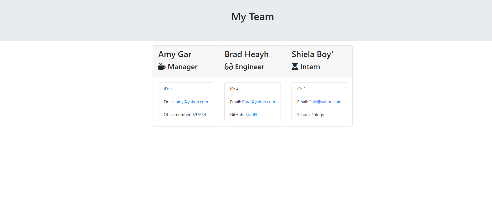

# TemplateEngine - WorkersBasicInfo

## User Story

As a manager
I want to generate a webpage that displays my team's basic info
so that I have quick access to emails and GitHub profiles.

## Project Expectation

As a programmer, the challenge is to build a Node CLI that takes in information about employees and generates an HTML webpage that displays summaries for each person.

## Acceptance Criteria

* A command line that accepts user input
* A Team Profile Generator with the following contents:
  
  A. MANAGER:
  - Designation
  - Name
  - ID Number
  - Office Number

  B. ENGINEER:
  - Name
  - ID Number
  - Email
  - Github UserName

  C. INTERN:
  - Name
  - ID Number
  - Email Address
  - School

## Technologies used to create Template Engine

* Javascript
* Node.js
* FS
* Inquirer

 

## To view the walkthrough video, please click on the link below

[Template Engine Video](https://drive.google.com/file/d/1saK9VSD55evSBLN8R1F3GDpzNbbl4V0K/view)

 

## Template Engine Screenshot

=======
